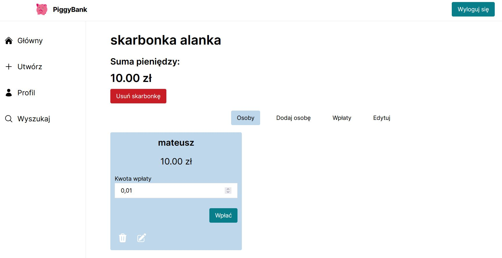

# Piggy Bank Online

## A web app built with Next.js that allows users to display and manage the contents of piggy banks.

Piggy Bank Online is a dynamic web application, designed to empower users in managing their savings easily. This innovative platform revolutionizes the age-old concept of piggy banks by bringing it into the digital era. With Piggy Bank Online, users can seamlessly monitor and control the contents of their virtual piggy banks from anywhere, at any time.

### [Live site](https://piggybankonline.vercel.app/)

### Built with

- Html5 semantic
- TailwindCSS
- Next.js
- MongoDB
- Clerk
- server actions